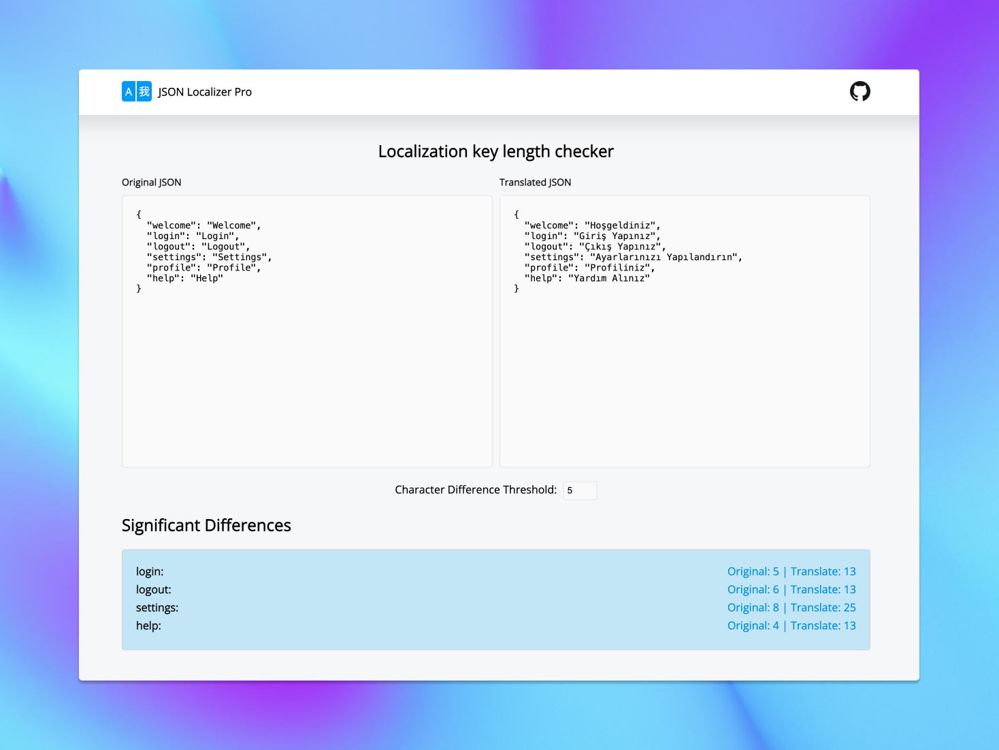

---

# JSON Localizer Pro

JSON Localizer Pro is a web-based tool designed to assist with JSON localization and length analysis across different languages. It helps identify potential issues with text length that might affect user interfaces when translating content.

## Features

- **JSON Localization:** Easily compare original and translated JSON strings.
- **Length Analysis:** Highlight significant differences in text length.
- **Nested JSON Support:** Handle complex, nested JSON structures.
- **Responsive Design:** Optimized for both desktop and mobile devices.

